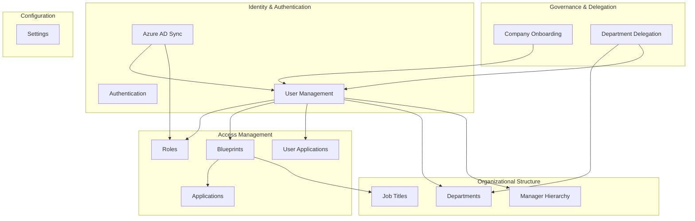

# Business Domains

## Domain Map

---

## 1. Identity & Authentication

**Purpose:** Authenticate users and maintain a local identity record synchronized with Azure Entra ID.

**Core concepts:**
- Users have a local record linked to Azure via `azureId`
- Sources: `APP` (created in-app), `ENTRA` (synced from Azure), `HR` (planned)
- Password-based login for local accounts; JWT bearer for API access
- Periodic sync deactivates users removed from Azure

**Key entities:** `User`, `UserRole`, `Role`

**Key services:** `AuthService`, `UserService`, `AzureADService`

**Business rules:**
- User must exist locally to authenticate via JWT (Azure token alone is insufficient)
- Inactive users are rejected at login
- Default role `"user"` required for new user creation
- Admin roles: `"administration"`, `"super_admin"` (password reset authorization)

---

## 2. Role Management

**Purpose:** Define and assign platform-level roles to users. Roles are partially synced from Azure AD security groups.

**Core concepts:**
- Platform roles (e.g., `user`, `manager`, `administration`) stored in `roles` table
- Many-to-many via `user_roles` composite key
- Azure groups auto-created as local roles during sync

**Key entities:** `Role`, `UserRole`, `UserRoleId`

**Key services:** `RoleService`

---

## 3. Application Catalog & Entitlements

**Purpose:** Maintain a catalog of integrated applications and track which users have access to each.

**Core concepts:**
- Applications represent SaaS tools (Slack, Jira, etc.)
- `UserApplication` tracks active assignments with timestamps
- Application-specific roles exist separately (`ApplicationRole`) but blueprint mappings currently store role names as strings

**Key entities:** `Application`, `ApplicationRole`, `UserApplication`

**Key services:** `ApplicationService`

**Business rules:**
- Slack and Jira flagged as "essential" applications in UI mapping logic
- Unique constraint: one `(user_id, application_id)` pair per assignment

---

## 4. Blueprints (Access Templates)

**Purpose:** Define reusable access templates that map job titles to application role bundles. When assigned to a user, a blueprint determines their application access profile.

**Core concepts:**
- A blueprint links N job titles to M application-role mappings
- `BlueprintApplicationRole` stores application + role name (denormalized string, not FK to `ApplicationRole`)
- Users reference a single blueprint via `user.blueprint_id`

**Key entities:** `Blueprint`, `BlueprintApplicationRole`, `JobTitle`

**Key services:** `BluePrintService`

**Business rules:**
- Blueprint name must be unique (case-insensitive)
- At least one job title and one application required on create
- Application role FK (`applicationRole`) is set to `null` — role stored as string only

---

## 5. Organizational Structure

**Purpose:** Model departments, job titles, and manager-subordinate relationships for HR-aligned identity data.

**Core concepts:**
- Departments carry `externalId` / `externalSource` for HR system integration (Odoo, Workday, SAP — enum exists but fields are strings)
- Job titles uniquely identified by `(name, external_source)`
- Self-referential manager hierarchy on `User`

**Key entities:** `Department`, `JobTitle`, `User` (manager/subordinates)

**Key services:** `DepartmentService`, `JobTitleService`

---

## 6. Company Onboarding

**Purpose:** Register client companies with an approver (manager) and primary contact user.

**Core concepts:**
- Company created with status `APPROVED` immediately (approval workflow entity exists but is unused)
- Primary contact user created via `UserService` (provisions Azure AD account)
- Approver becomes manager of primary contact

**Key entities:** `Company`, `CompanyContact` (orphaned — relationship commented out), `CompanyApprovalRequest` (unused)

**Key services:** `CompanyService`

**Incomplete features:**
- `CompanyApprovalRequest` entity and approval DTOs exist with no controller/service
- Company status always set to `APPROVED` on create

---

## 7. Department Delegation

**Purpose:** Allow users to request temporary access to manage users in other departments, with approval workflow.

**Core concepts:**
- User submits delegation request for a target department
- Approver acts (approve/reject) on pending requests
- Approved requests grant `UserDepartmentAccess` record
- Revocation removes access and marks request `REVOKED`

**Key entities:** `DelegateRequest`, `UserDepartmentAccess`

**Key services:** `DelegateService`

**Business rules:**
- Only one `PENDING` request per user+department
- Revoke allowed by requester or original approver
- `getDelegatedUsers` returns all users in departments the requester has access to

---

## 8. System Configuration

**Purpose:** Key-value application settings with typed parsing.

**Key entities:** `Setting` (table: `idf_settings`)

**Key services:** `SettingService`

---

## Domain Boundaries & Overlap

| Overlap Area | Domains Involved | Risk |
|--------------|------------------|------|
| User creation | Identity + Company + Blueprint | `UserService.createUser` is a god method spanning Azure, roles, blueprints, company manager assignment |
| Role sync | Identity + Role | Azure groups blindly become local roles |
| Application access | Blueprint + User Application | Blueprint defines template; actual provisioning to `user_applications` not visible in service layer |
| HR integration | Org Structure + Identity | External source fields exist but no sync implementation |

---

## Bounded Context Maturity

| Domain | Maturity | Notes |
|--------|----------|-------|
| User Management | Medium | Core CRUD works; sync is functional |
| Authentication | Low | Plain-text password login; JWT config mismatch |
| Blueprints | Medium | CRUD complete; role FK unused |
| Delegation | Medium | Full workflow implemented |
| Company Onboarding | Low | Approval workflow scaffolded but bypassed |
| Application Provisioning | Low | Read-only API; no write endpoints |
| HR Integration | Scaffold only | Enums/fields exist, no sync |
