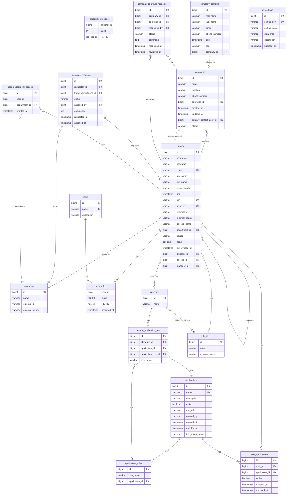

# Database Model

## Schema

- **Database:** PostgreSQL
- **Schema:** `identity_framework` (via JDBC URL `currentSchema=identity_framework`)
- **DDL strategy:** Hibernate `ddl-auto: update` (no Flyway/Liquibase migrations)
- **Dialect:** `PostgreSQLDialect`

---

## Entity-Relationship Diagram



---

## Tables (17 entities + 1 join table)

### Core Identity

#### `users`

| Column | Type | Constraints | Notes |
|--------|------|-------------|-------|
| id | BIGINT | PK, AUTO | |
| username | VARCHAR | | |
| password | VARCHAR | | BCrypt for new users; plain text for some synced users |
| email | VARCHAR | NOT NULL, UNIQUE | |
| first_name, last_name | VARCHAR | | |
| phone_number | VARCHAR | | |
| dob | TIMESTAMP | | |
| ssn | VARCHAR | UNIQUE | Masked in API responses |
| azure_id | VARCHAR | UNIQUE | Entra object ID |
| external_id | VARCHAR | | HR system ID |
| external_source | VARCHAR | | String, not enum |
| job_title_name | VARCHAR | | Denormalized |
| department_id | BIGINT | FK → departments | LAZY |
| source | VARCHAR | NOT NULL | Enum: APP, ENTRA, HR |
| active | BOOLEAN | DEFAULT true | Soft delete via deactivation |
| last_synced_at | TIMESTAMP | | |
| blueprint_id | BIGINT | FK → blueprints | |
| job_title_id | BIGINT | FK → job_titles | |
| manager_id | BIGINT | FK → users | Self-referential |

**Relationships:**
- `@OneToMany` → `user_roles` (cascade ALL, orphanRemoval)
- `@OneToMany` → subordinates (inverse, no cascade)
- `@ManyToOne` → department, blueprint, jobTitle, manager

---

#### `roles`

| Column | Type | Constraints |
|--------|------|-------------|
| id | BIGINT | PK |
| name | VARCHAR | UNIQUE |
| description | VARCHAR | |

**Cascade:** `@OneToMany` → `user_roles` (ALL, orphanRemoval)

---

#### `user_roles` (composite PK)

| Column | Type | Constraints |
|--------|------|-------------|
| user_id | BIGINT | PK, FK → users |
| role_id | BIGINT | PK, FK → roles |
| assigned_at | TIMESTAMP | NOT NULL |

**Embeddable:** `UserRoleId` with `@MapsId` pattern

---

### Applications & Access

#### `applications`

| Column | Type | Constraints |
|--------|------|-------------|
| id | BIGINT | PK |
| name | VARCHAR(100) | NOT NULL, UNIQUE |
| description | VARCHAR(255) | |
| active | BOOLEAN | DEFAULT true |
| app_url | VARCHAR(255) | |
| created_by | VARCHAR(50) | NOT NULL on insert |
| created_at, updated_at | TIMESTAMP | Auto-set via `@PrePersist`/`@PreUpdate` |
| integration_name | VARCHAR | |

#### `application_roles`

| Column | Type | Constraints |
|--------|------|-------------|
| id | BIGINT | PK |
| role_name | VARCHAR | |
| application_id | BIGINT | FK → applications |

#### `user_applications`

| Column | Type | Constraints |
|--------|------|-------------|
| id | BIGINT | PK |
| user_id | BIGINT | FK, NOT NULL |
| application_id | BIGINT | FK, NOT NULL |
| active | BOOLEAN | DEFAULT true |
| assigned_at | TIMESTAMP | NOT NULL |
| removed_at | TIMESTAMP | nullable |

**Unique:** `(user_id, application_id)`

---

### Blueprints

#### `blueprints`

| Column | Type | Constraints |
|--------|------|-------------|
| id | BIGINT | PK |
| name | VARCHAR | |

#### `blueprint_job_titles` (join table)

| Column | Type | Constraints |
|--------|------|-------------|
| blueprint_id | BIGINT | FK |
| job_title_id | BIGINT | FK |

#### `blueprint_application_roles`

| Column | Type | Constraints |
|--------|------|-------------|
| id | BIGINT | PK |
| blueprint_id | BIGINT | FK |
| application_id | BIGINT | FK |
| application_role_id | BIGINT | FK, nullable (currently always null) |
| role_name | VARCHAR | NOT NULL (denormalized) |

**Cascade:** Owned by blueprint (ALL, orphanRemoval)

---

### Organization

#### `departments`

| Column | Type | Constraints |
|--------|------|-------------|
| id | BIGINT | PK |
| name | VARCHAR | NOT NULL |
| external_id | VARCHAR | |
| external_source | VARCHAR | |

#### `job_titles`

| Column | Type | Constraints |
|--------|------|-------------|
| id | BIGINT | PK |
| name | VARCHAR | |
| external_source | VARCHAR | |

**Unique:** `(name, external_source)`

---

### Companies

#### `companies`

| Column | Type | Constraints |
|--------|------|-------------|
| id | BIGINT | PK |
| name | VARCHAR | |
| location | VARCHAR | |
| phone_number | VARCHAR | |
| approver_id | BIGINT | FK → users |
| created_at, updated_at | TIMESTAMP | |
| primary_contact_user_id | BIGINT | FK → users |
| status | VARCHAR | Enum: PENDING, APPROVED, REJECTED, REVOKED |

#### `company_contacts` (orphaned entity)

| Column | Type | Constraints |
|--------|------|-------------|
| id | BIGINT | PK |
| first_name, last_name, email, phone_number | VARCHAR | |
| dob | TIMESTAMP | |
| ssn | VARCHAR | |
| company_id | BIGINT | FK → companies |

**Note:** Inverse `@OneToOne` on `Company` is commented out. Contact data now stored on `User` entity.

#### `company_approval_requests` (unused)

| Column | Type | Constraints |
|--------|------|-------------|
| id | BIGINT | PK |
| company_id | BIGINT | FK, NOT NULL |
| approver_id | BIGINT | FK, NOT NULL |
| requested_by | BIGINT | FK |
| status | VARCHAR | DEFAULT PENDING |
| comments | TEXT | |
| requested_at | TIMESTAMP | NOT NULL |
| reviewed_at | TIMESTAMP | |

**No repository or service** — dead schema.

---

### Delegation

#### `delegate_requests`

| Column | Type | Constraints |
|--------|------|-------------|
| id | BIGINT | PK |
| requester_id | BIGINT | FK, NOT NULL |
| target_department_id | BIGINT | FK, NOT NULL |
| status | VARCHAR | Enum |
| actioned_by | BIGINT | FK |
| comments | TEXT | |
| requested_at | TIMESTAMP | |
| actioned_at | TIMESTAMP | |

#### `user_department_access`

| Column | Type | Constraints |
|--------|------|-------------|
| id | BIGINT | PK |
| user_id | BIGINT | FK |
| department_id | BIGINT | FK |
| granted_at | TIMESTAMP | |

---

### Configuration

#### `idf_settings`

| Column | Type | Constraints |
|--------|------|-------------|
| id | BIGINT | PK |
| setting_key | VARCHAR | UNIQUE, NOT NULL |
| setting_value | VARCHAR | |
| data_type | VARCHAR | e.g., BOOLEAN |
| description | VARCHAR | |
| updated_at | TIMESTAMP | |

---

## Enums

| Enum | Values | Persisted As |
|------|--------|--------------|
| `UserSource` | APP, ENTRA, HR | STRING on `users.source` |
| `RequestStatus` | PENDING, APPROVED, REJECTED, REVOKED | STRING on companies, delegate_requests, company_approval_requests |
| `ExternalSource` | ODOO, WORKDAY, SAP | **Not used in JPA** — fields are plain VARCHAR |

---

## Embeddables

### `UserRoleId`

Composite primary key for `user_roles`:
- `userId: Long`
- `roleId: Long`

Synchronized via `@PrePersist`/`@PreUpdate` and custom setters on `UserRole`.

---

## Cascade Rules Summary

| Parent | Child | Cascade | Orphan Removal |
|--------|-------|---------|----------------|
| User | UserRole | ALL | true |
| Role | UserRole | ALL | true |
| Blueprint | BlueprintApplicationRole | ALL | true |
| All others | — | None | — |

---

## Repository Custom Queries

### BlueprintRepository

```sql
-- findByJobTitleId
SELECT DISTINCT b FROM Blueprint b
JOIN b.jobTitles jt WHERE jt.id = :jobTitleId

-- findByJobTitleIdWithApps (with fetch joins)
SELECT DISTINCT b FROM Blueprint b
LEFT JOIN FETCH b.applicationRoles ar
LEFT JOIN FETCH ar.application
JOIN FETCH b.jobTitles jt WHERE jt.id = :jobTitleId
```

### UserRepository

- `@EntityGraph` on `findDistinctByUserRolesRoleNameIgnoreCase` — eagerly loads userRoles and roles
- Default method `findAllManagers()` delegates to role name `"manager"`

### No Specifications, Projections, or Native Queries

All other repositories use Spring Data derived query methods only.

---

## Data Integrity Concerns

1. **Dual cascade on UserRole** — both `User` and `Role` declare `CascadeType.ALL` on `userRoles`; potential for conflicting ownership
2. **Blueprint role denormalization** — `role_name` string without FK enforcement to `application_roles`
3. **No migration tool** — schema changes applied at runtime via Hibernate
4. **Secrets in application.yaml** — database credentials, Azure secrets, Jira token committed to config file
5. **SSN stored in plaintext** — only masked at API layer
