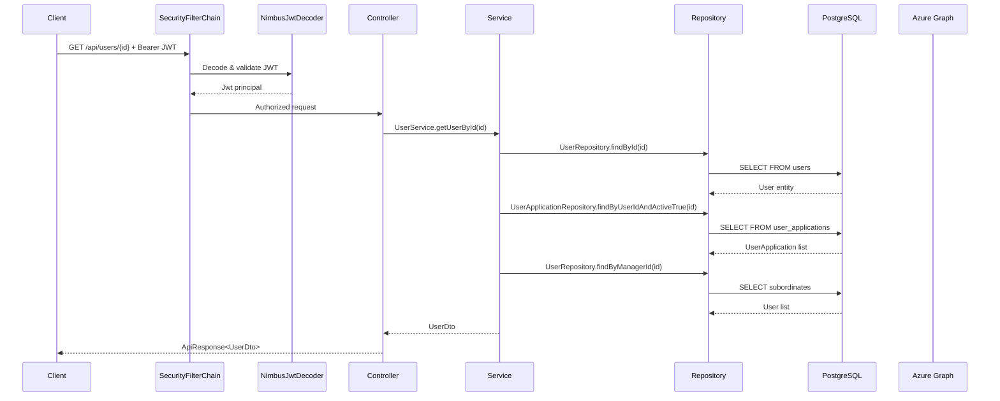
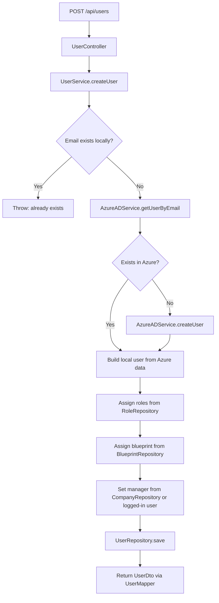
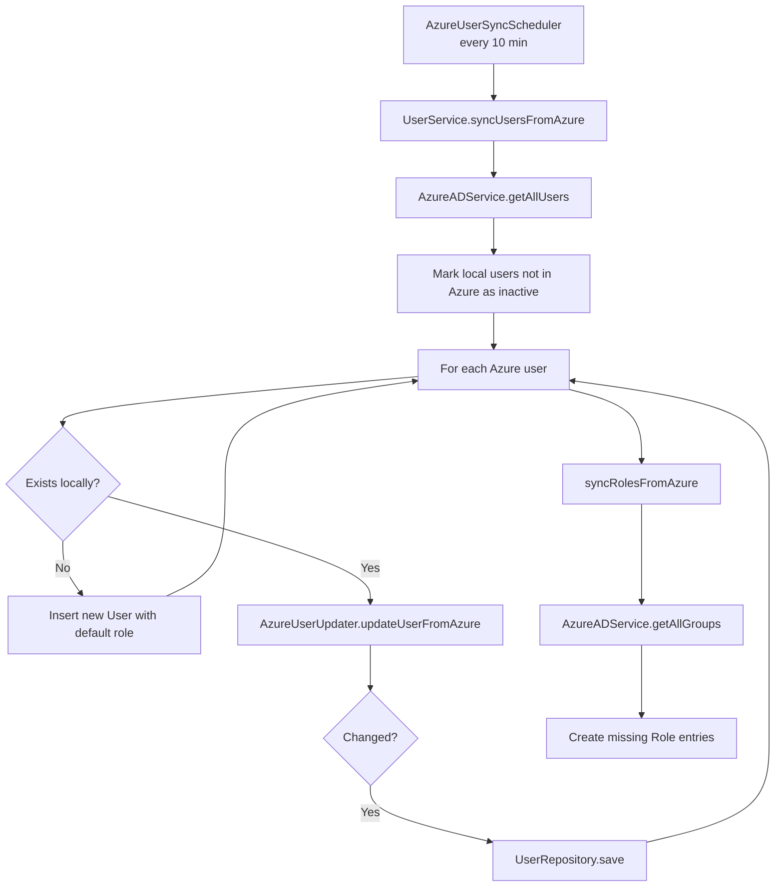
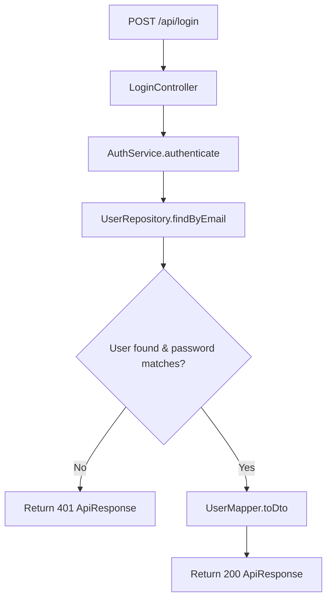
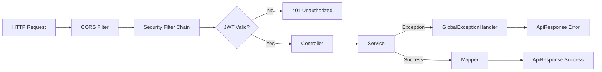
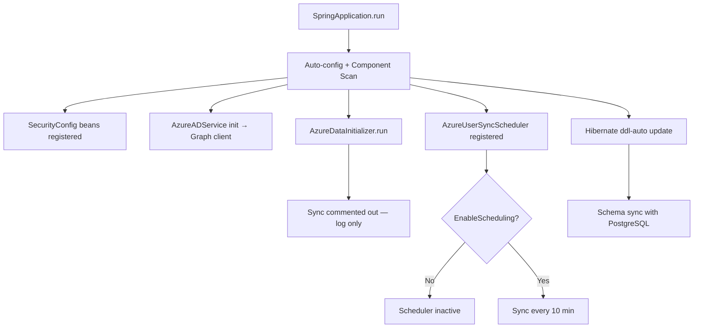
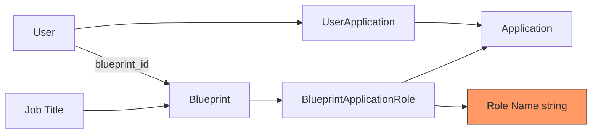

# Dependency Flow

## Request Flow — Authenticated API Call



---

## Request Flow — User Creation (with Azure)



---

## Request Flow — Azure Sync (Scheduled)



---

## Request Flow — Delegation Approval

```mermaid
flowchart TD
    A[POST /api/delegates/request] --> B[DelegateService.createRequest]
    B --> C{Pending request exists?}
    C -->|Yes| D[Throw: already pending]
    C -->|No| E[Save DelegateRequest PENDING]

    F[POST /api/delegates/{id}/action] --> G[DelegateService.actOnRequest]
    G --> H[Update request status]
    H --> I{Status = APPROVED?}
    I -->|Yes| J[Create UserDepartmentAccess]
    I -->|No| K[Done]

    L[POST /api/delegates/revoke] --> M[DelegateService.revokeDelegate]
    M --> N[Set status REVOKED]
    N --> O[Delete UserDepartmentAccess]
```

---

## Request Flow — Login (Password)



---

## Layer Dependency Graph

```mermaid
graph TD
    subgraph Presentation
        LC[LoginController]
        UC[UserController]
        RC[RoleController]
        AC[ApplicationController]
        BC[BlueprintController]
        CC[CompanyController]
        DC[DepartmentController]
        JC[JobTitleController]
        DEC[DelegateController]
        SC[SettingController]
        AZC[AzureController]
    end

    subgraph Services
        AUTH[AuthServiceImpl]
        USER[UserServiceImpl]
        ROLE[RoleServiceImpl]
        APP[ApplicationService]
        BLUE[BluePrintServiceImpl]
        COMP[CompanyService]
        DEPT[DepartmentServiceImpl]
        JOB[JobTitleServiceImpl]
        DELEG[DelegateServiceImpl]
        SET[SettingService]
        AZS[AzureADService]
    end

    subgraph Infrastructure
        UR[UserRepository]
        RR[RoleRepository]
        AR[ApplicationRepository]
        UAR[UserApplicationRepository]
        BR[BlueprintRepository]
        CR[CompanyRepository]
        DR[DepartmentRepository]
        JR[JobTitleRepository]
        DRR[DelegateRequestRepository]
        UDAR[UserDepartmentAccessRepository]
        SR[SettingRepository]
    end

    subgraph External
        PG[(PostgreSQL)]
        GRAPH[Microsoft Graph]
    end

    LC --> AUTH
    UC --> USER
    RC --> ROLE
    AC --> APP
    BC --> BLUE
    CC --> COMP
    DC --> DEPT
    JC --> JOB
    DEC --> DELEG
    SC --> SET
    AZC --> AZS

    AUTH --> UR
    USER --> UR & RR & UAR & BR & CR & AZS
    ROLE --> RR
    APP --> AR & UAR
    BLUE --> BR & JR & AR
    COMP --> CR & UR & USER
    DEPT --> DR
    JOB --> JR
    DELEG --> DRR & UDAR & UR & DR
    SET --> SR
    AZS --> GRAPH

    UR & RR & AR & UAR & BR & CR & DR & JR & DRR & UDAR & SR --> PG
```



---

## Controller → Service → Repository Quick Reference

| Controller | Service | Repositories |
|------------|---------|-------------|
| LoginController | AuthServiceImpl | UserRepository |
| UserController | UserServiceImpl | User, Role, UserApplication, Blueprint, Company |
| RoleController | RoleServiceImpl | RoleRepository |
| ApplicationController | ApplicationService | Application, UserApplication |
| BlueprintController | BluePrintServiceImpl | Blueprint, JobTitle, Application |
| CompanyController | CompanyService | Company, User (+ UserService) |
| DepartmentController | DepartmentServiceImpl | DepartmentRepository |
| JobTitleController | JobTitleServiceImpl | JobTitleRepository |
| DelegateController | DelegateServiceImpl | DelegateRequest, UserDepartmentAccess, User, Department |
| SettingController | SettingService | SettingRepository |
| AzureController | AzureADService | — (Graph API only) |

---

## Cross-Cutting Concerns Flow



---

## Startup Flow



---

## Data Flow — Blueprint to User Access (Conceptual)



**Gap:** No automated flow from blueprint assignment to `user_applications` provisioning visible in service layer. Blueprint defines template; user applications appear to be managed separately.
