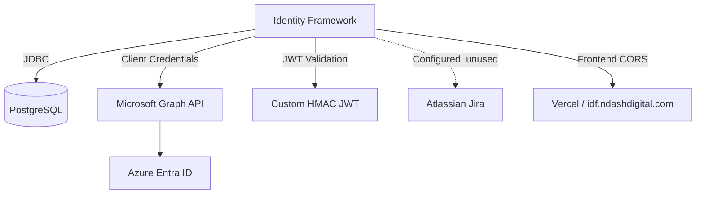

# External Integrations

## Integration Map



---

## 1. PostgreSQL Database

| Attribute | Detail |
|-----------|--------|
| **Driver** | `org.postgresql:postgresql:42.7.7` |
| **Connection** | `jdbc:postgresql://coolify.ndashdigital.com:5432/postgres?currentSchema=identity_framework` |
| **Pool** | HikariCP — max 10, min idle 2 |
| **ORM** | Hibernate via Spring Data JPA |
| **DDL** | `hibernate.ddl-auto: update` |
| **Dialect** | `PostgreSQLDialect` |

### How It Works
- All entities persisted through Spring Data JPA repositories
- Schema auto-managed by Hibernate on startup
- No connection to H2 in production config (H2 dependency present for potential local dev)

### Risks
- Credentials hardcoded in `application.yaml`
- No migration versioning
- `ddl-auto: update` unsafe for production schema changes

---

## 2. Microsoft Entra ID (Azure AD)

| Attribute | Detail |
|-----------|--------|
| **SDK** | `azure-identity:1.7.0`, `microsoft-graph:5.0.0` |
| **Auth Flow** | Client Credentials (app-only) |
| **Scope** | `https://graph.microsoft.com/.default` |
| **Config** | `azure.tenant-id`, `azure.client-id`, `azure.client-secret` |

### How It Works

**Service:** `AzureADService`

1. On construction, builds `ClientSecretCredential` from config properties
2. Creates `GraphServiceClient` with `TokenCredentialAuthProvider`
3. Exposes CRUD operations on Azure users and groups

**User Lifecycle Integration (`UserServiceImpl`):**
- **Create:** Check Azure by email → create if missing → store `azureId` locally
- **Sync:** Every 10 min (scheduled) — fetch all Azure users, deactivate missing, insert/update local records
- **Delete:** Delete from Azure first, then local DB
- **Role sync:** Azure security groups → local `Role` entities (by display name)

**Authentication Integration (`AuthServiceImpl`):**
- JWT login validates user exists locally by `azureId` (claim `oid`)
- Azure ROPC password grant is commented out

### Graph API Operations

| Operation | Endpoint | Used By |
|-----------|----------|---------|
| List users | `GET /users` | Sync, AzureController |
| Create user | `POST /users` | UserService, AzureController |
| Delete user | `DELETE /users/{id}` | UserService, AzureController |
| List groups | `GET /groups` | Role sync |
| Filter by email | `GET /users?$filter=mail eq '...'` | User create lookup |
| Update user | `PATCH /users/{id}` | Commented out in updateUser |

### Limitations
- No pagination — only first page of users/groups fetched
- Hardcoded `@NETORGFT16179011.onmicrosoft.com` domain
- Hardcoded default password for new Azure users
- Azure REST endpoints exposed without authentication at `/api/azure/**`

---

## 3. JWT / OAuth2 Resource Server

| Attribute | Detail |
|-----------|--------|
| **Library** | Spring Security OAuth2 Resource Server + Nimbus JOSE JWT |
| **Validation** | HMAC-SHA256 with `${jwt.secret}` |
| **Issuer config** | Azure AD issuer URI in properties (not actively used) |

### How It Works
1. Client sends `Authorization: Bearer <token>` header
2. `NimbusJwtDecoder` validates signature with symmetric secret
3. Decoded `Jwt` principal available in controllers via `@AuthenticationPrincipal`
4. Protected routes require valid JWT; no role checks at filter level

### Mismatch
Properties reference Azure AD issuer (`login.microsoftonline.com`) suggesting intent to validate Azure tokens, but the active decoder uses a local HMAC secret. These are incompatible unless a custom token issuer exists.

---

## 4. Atlassian Jira (Configured, Not Integrated)

| Attribute | Detail |
|-----------|--------|
| **Config** | `jira.api-token`, `jira.base-url`, `jira.admin-email` |
| **Code usage** | **None** — no service, controller, or client references Jira |
| **DTO reference** | `UserMapper` hardcodes "Jira" as essential application name |

### Status
Configuration appears to be **planned but not implemented**. The API token is stored in `application.yaml` (security risk with no corresponding functionality).

---

## 5. Frontend Applications (CORS)

| Origin | Purpose |
|--------|---------|
| `https://identityframework.vercel.app` | Production frontend (Vercel) |
| `https://idf.ndashdigital.com/` | Production frontend (custom domain) |
| `http://localhost:3000/` | Local development |

CORS configured in `SecurityConfig.corsConfigurationSource()` — not an SDK integration but a cross-origin dependency.

---

## 6. Spring Actuator

| Attribute | Detail |
|-----------|--------|
| **Dependency** | `spring-boot-starter-actuator` |
| **Exposed** | `/actuator/health`, `/actuator/info` |
| **Auth** | Public (permitAll) |

Used for deployment health checks. Health details always visible.

---

## 7. HR Systems (Scaffold Only)

| Attribute | Detail |
|-----------|--------|
| **Enum** | `ExternalSource`: ODOO, WORKDAY, SAP |
| **Fields** | `User.externalId`, `User.externalSource`, `Department.externalId`, `JobTitle.externalSource` |
| **Integration** | **None implemented** |

Fields exist for future HR system sync but no connectors, schedulers, or API clients exist.

---

## Integration Dependency Matrix

| System | SDK/API | Direction | Auth Method | Status |
|--------|---------|-----------|-------------|--------|
| PostgreSQL | JDBC | Bidirectional | Username/password | Active |
| Azure Entra ID | Microsoft Graph REST | Outbound | Client credentials | Active |
| Azure OAuth | Token endpoint | — | ROPC (commented) | Inactive |
| JWT | Custom | Inbound | HMAC secret | Active |
| Jira | REST (planned) | — | API token in config | Not implemented |
| HR (Odoo/Workday/SAP) | — | — | — | Not implemented |
| Redis | — | — | — | Not present |
| Email/SMTP | — | — | — | Not present |
| File storage | — | — | — | Not present |
| Message queue | — | — | — | Not present |

---

## Network Topology (Inferred)

```
Internet
  ├── Frontend (Vercel) ──HTTPS──► Identity Framework API
  ├── Identity Framework ──JDBC──► PostgreSQL (coolify.ndashdigital.com:5432)
  └── Identity Framework ──HTTPS──► graph.microsoft.com (Azure Graph)
```

---

## Configuration Properties Reference

| Property | Integration |
|----------|-------------|
| `spring.datasource.*` | PostgreSQL |
| `azure.tenant-id` | Azure AD |
| `azure.client-id` | Azure AD |
| `azure.client-secret` | Azure AD |
| `azure.graph.scope` | Microsoft Graph |
| `jwt.secret` | JWT validation |
| `spring.security.oauth2.resourceserver.jwt.issuer-uri` | Azure AD (unused) |
| `jira.*` | Jira (unused) |
| `management.endpoints.*` | Actuator |
