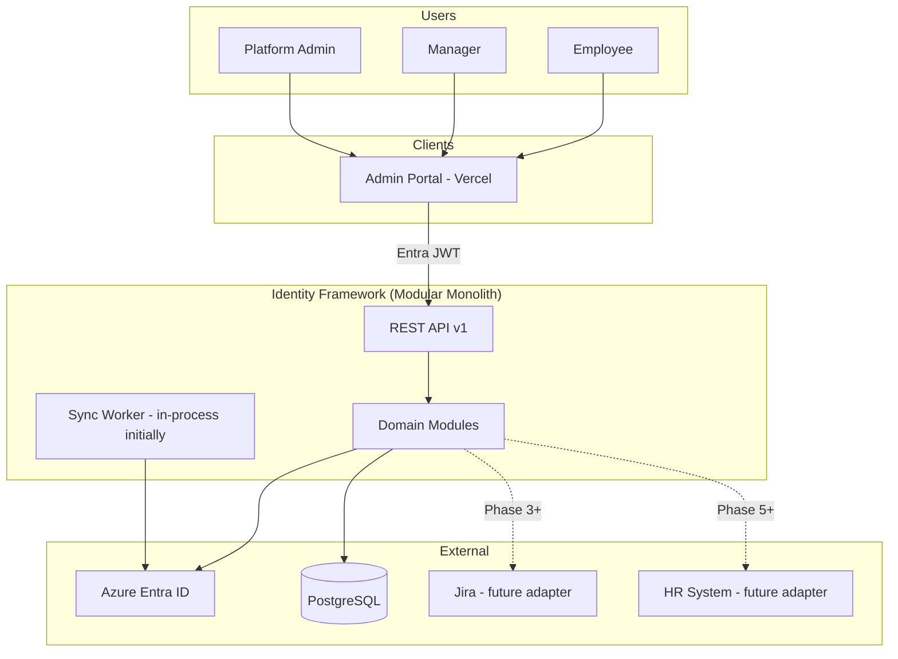
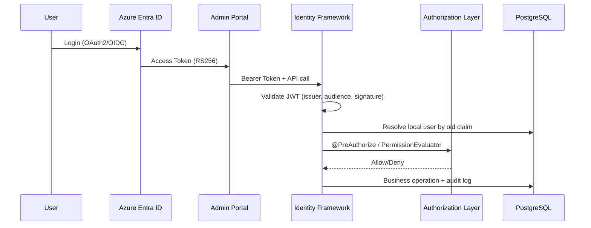

# Future-State Architecture Proposal

**Author:** Chief Software Architect (discovery-based)  
**Status:** Proposal — not approved for implementation  
**Scope:** identity-framework monolith  
**Audience:** Engineering leadership, platform team, product stakeholders

---

## 1. Executive Summary

identity-framework is positioned as nDash's **system of record for identity and access**, but it currently behaves like a **prototyping codebase that reached production**: correct domain instincts, immature operational and security posture, and accumulating structural debt that will block scale.

**Architectural thesis:**

> Retain a **modular monolith** for the next 12–18 months. Do **not** microservice-split prematurely. Instead, establish **hard module boundaries**, **correct the security model**, **introduce schema discipline**, and **decompose the god service** into domain-aligned components. Extract only **Azure sync** and **downstream provisioning** when independent scaling or failure isolation is proven necessary.

This proposal challenges several implicit decisions already baked into the codebase, defines a target architecture optimized for maintainability, scalability, security, and developer productivity, and lays out a gated six-phase migration.

---

## 2. Challenging Existing Architectural Decisions

Each item below is a decision that was made (explicitly or by omission). The assessment states why it should be reversed or replaced.

### 2.1 Decision: Hibernate `ddl-auto: update` in production

**What was chosen:** Schema owned by the application at startup.  
**Why it was likely chosen:** Speed of iteration; no migration tooling setup.  
**Why it is wrong:** Non-reproducible schema, unsafe rollbacks, no audit trail of DDL changes, risk of accidental column drops or type changes in production.  
**Target:** Flyway (preferred) or Liquibase; `ddl-auto: validate` in all non-local profiles.

---

### 2.2 Decision: Dual, incompatible authentication models

**What was chosen:** OAuth2 resource server config referencing Azure AD issuer URI, plus a custom HMAC `NimbusJwtDecoder`, plus a local username/password login with plaintext comparison.  
**Why it was likely chosen:** Frontend sends one token type; backend experimented with another; password login added for dev convenience.  
**Why it is wrong:** Security boundary is undefined. Azure RS256 tokens cannot validate against HMAC secret. Password path bypasses `PasswordEncoder`. Operators cannot reason about "who authenticated how."  
**Target:** Single canonical model — **Azure Entra ID as identity provider**, API validates Entra-issued JWTs (RS256 + issuer + audience). Deprecate local password login or isolate it behind a `local-dev` profile only.

---

### 2.3 Decision: Authentication without authorization

**What was chosen:** `authenticated()` on route prefixes; no `@PreAuthorize`, no permission model.  
**Why it was likely chosen:** MVP — "logged in = trusted."  
**Why it is wrong:** Any authenticated user can create users, sync Azure, modify blueprints, read settings, and manage companies. IAM system with no access control on its own admin API is a category error.  
**Target:** Role- and scope-based authorization aligned with platform roles (`user`, `manager`, `administration`, `super_admin`) plus fine-grained permissions for provisioning operations.

---

### 2.4 Decision: Public `/api/azure/**` Graph proxy

**What was chosen:** Azure AD CRUD endpoints fall through `anyRequest().permitAll()`.  
**Why it was likely chosen:** Debugging convenience during Azure integration.  
**Why it is wrong:** Unauthenticated callers can list, create, and delete Entra users if the deployment is reachable. This is not a design flaw — it is an **incident waiting to happen**.  
**Target:** Remove public Azure controller entirely, or restrict to `super_admin` with audit logging. All Entra mutations go through domain services.

---

### 2.5 Decision: `UserServiceImpl` as the universal orchestrator

**What was chosen:** One ~600-line service owns CRUD, Azure sync, role sync, blueprint assignment, manager hierarchy, password reset, and company linkage.  
**Why it was likely chosen:** Fastest path to ship user stories.  
**Why it is wrong:** Violates SRP; untestable in isolation; Azure I/O inside class-level `@Transactional`; every new feature increases regression blast radius.  
**Target:** Domain-scoped application services with a thin facade only where cross-domain orchestration is genuinely required.

---

### 2.6 Decision: Blueprint stores role names as strings, `applicationRole` FK always null

**What was chosen:** `BlueprintApplicationRole.roleName` as free text; `ApplicationRoleRepository` injected but unused.  
**Why it was likely chosen:** Frontend flexibility; incomplete modeling.  
**Why it is wrong:** No referential integrity; provisioning cannot reliably map blueprint → application entitlement; duplicate definitions drift over time.  
**Target:** Blueprint references `ApplicationRole` entities (or a stable role code enum per application). Role names validated at write time.

---

### 2.7 Decision: Company approval workflow scaffolded then bypassed

**What was chosen:** `CompanyApprovalRequest` entity + DTOs exist; `CompanyService` sets status `APPROVED` immediately.  
**Why it was likely chosen:** Product timeline pressure.  
**Why it is wrong:** Dead schema and DTOs mislead developers and consumers about system behavior; compliance narrative ("approval required") may be false.  
**Target:** Either implement the workflow end-to-end or delete the dead model in Phase 1. **No permanent scaffold-only domains.**

---

### 2.8 Decision: Jira configuration without integration

**What was chosen:** API token and base URL in committed config; "Jira" hardcoded as essential app in mapper.  
**Why it was likely chosen:** Planned integration.  
**Why it is wrong:** Secret exposure with zero value; false signal of capability.  
**Target:** Remove config until a provisioning adapter is implemented; drive "essential app" from database or settings.

---

### 2.9 Decision: Manual mappers, mixed static and component styles

**What was chosen:** Hand-written mapping in `UserMapper`, `ApplicationService`, etc.  
**Why it was likely chosen:** No MapStruct setup; speed.  
**Why it is wrong:** Duplication (`UserApplicationDto` mapped in two places); business rules (Slack/Jira essential) leak into mappers; refactors miss fields silently.  
**Target:** MapStruct with compile-time verification; presentation rules separated from domain mapping.

---

### 2.10 Decision: `@Data` on JPA entities

**What was chosen:** Lombok `@Data` on `User`, `Company`, etc.  
**Why it was likely chosen:** Brevity.  
**Why it is wrong:** Generated `equals`/`hashCode` across relationships causes subtle Hibernate bugs and collection corruption.  
**Target:** `@Getter`/`@Setter` + `@EqualsAndHashCode(onlyExplicitlyIncluded = true)` on `@Id` only (already correct on `Blueprint`).

---

### 2.11 Decision: Scheduled sync without `@EnableScheduling`

**What was chosen:** `AzureUserSyncScheduler` component exists; scheduling may not be active.  
**Why it is likely an oversight.**  
**Why it matters:** Operators believe sync runs every 10 minutes; it may not. Data drift between Entra and local DB goes undetected.  
**Target:** Explicit scheduling config, metrics on sync runs, alerting on failure.

---

### 2.12 Decision: Secrets in `application.yaml`

**What was chosen:** DB password, Azure client secret, JWT secret, Jira token in committed file.  
**Why it was likely chosen:** Small team, Coolify deployment simplicity.  
**Why it is wrong:** Irreversible exposure if repo is ever shared, forked, or leaked. Rotation requires code change.  
**Target:** Environment injection only; Spring Cloud optional; sealed secrets in Coolify/K8s; `.env.example` with placeholders.

---

## 3. Technical Debt Register

Prioritized by **interest rate** (cost of delay).

| ID | Debt Item | Interest Rate | Paydown Phase |
|----|-----------|---------------|---------------|
| TD-01 | Secrets in VCS | Critical — compounds daily | Phase 0 |
| TD-02 | Plaintext password auth path | Critical | Phase 0 |
| TD-03 | Public Azure API | Critical | Phase 0 |
| TD-04 | No schema migrations | High | Phase 1 |
| TD-05 | UserServiceImpl god class | High | Phase 2 |
| TD-06 | Zero automated tests | High | Phase 1 |
| TD-07 | JWT model inconsistency | High | Phase 2 |
| TD-08 | No RBAC | High | Phase 2 |
| TD-09 | Blueprint → provisioning gap | High | Phase 3 |
| TD-10 | Full-table scans in search/sync | Medium | Phase 4 |
| TD-11 | Dead approval/Jira/TestRunner code | Medium | Phase 1 |
| TD-12 | Inconsistent API envelope | Medium | Phase 1 |
| TD-13 | SSN plaintext at rest | Medium | Phase 3 |
| TD-14 | No audit trail | Medium | Phase 3 |
| TD-15 | Manual mappers | Low–Medium | Phase 5 |
| TD-16 | No API versioning | Low | Phase 5 |

**Debt policy going forward:** No new features on top of TD-01 through TD-04 without a parallel paydown story.

---

## 4. Future-State Architecture

### 4.1 Target: Modular Monolith

Stay one deployable, one database, **multiple bounded modules** with enforced dependency rules.

```
com.ndash.identity_framework
├── bootstrap/              # Application entry, config profiles
├── shared/                 # Cross-cutting: exceptions, ApiResponse, util
│
├── identity/               # Bounded context: users, auth, Entra sync
│   ├── api/                # UserController, LoginController
│   ├── application/        # UserQueryService, UserCommandService, AuthService
│   ├── domain/             # User, UserRole aggregates
│   ├── infrastructure/     # UserRepository, AzureIdentityAdapter
│   └── sync/               # AzureSyncJob, SyncMetrics
│
├── access/                 # Roles, applications, blueprints, entitlements
│   ├── api/
│   ├── application/        # BlueprintService, EntitlementProvisioner
│   ├── domain/
│   └── infrastructure/
│
├── organization/           # Departments, job titles, manager hierarchy
│   ├── api/
│   ├── application/
│   ├── domain/
│   └── infrastructure/
│
├── governance/             # Delegation, company onboarding
│   ├── api/
│   ├── application/
│   ├── domain/
│   └── infrastructure/
│
└── platform/               # Settings, actuator extensions, feature flags
    ├── api/
    ├── application/
    └── infrastructure/
```

**Module dependency rule (enforced via ArchUnit):**

```
api → application → domain
application → infrastructure (via ports/interfaces)
identity.sync → identity.application (one-way)
access.application → identity.application (read-only queries via facade)
governance.application → identity + organization (orchestration)
NO domain → infrastructure
NO cross-module repository access
```

---

### 4.2 Target System Context (C4 Level 1)



---

### 4.3 Target Container View (C4 Level 2)

| Container | Responsibility | Scale Strategy |
|-----------|----------------|----------------|
| **API Server** | REST, authZ, request validation | Horizontal — stateless |
| **Sync Job** | Entra delta sync, role import | In-process `@Scheduled` → optional separate worker in Phase 5 |
| **PostgreSQL** | System of record | Vertical + read replica (Phase 5) if needed |
| **Entra ID** | Authoritative identity | External SaaS |

**Explicit non-goals for 18 months:** Separate user-service microservice, event bus mandatory for all operations, CQRS read models.

---

### 4.4 Security Architecture (Target)



**Principles:**

1. **Entra is the only production identity provider.** Local password auth removed or dev-profile only.
2. **Defense in depth:** Network (private DB) + TLS + JWT + RBAC + audit.
3. **Least privilege:** Default deny; explicit grants for provisioning, sync trigger, settings write.
4. **No admin proxy endpoints** that bypass domain validation.
5. **PII encryption:** SSN and similar fields via JPA `AttributeConverter` + KMS-managed key.
6. **Secrets:** Zero in repo; rotation runbook documented.

**Authorization model:**

| Layer | Mechanism |
|-------|-----------|
| Route | Spring Security + OAuth2 scopes (optional) |
| Method | `@PreAuthorize("hasAuthority('user:write')")` |
| Domain | Policy classes for delegation revoke, password reset |
| Data | Row-level: manager sees subordinates; delegate sees granted departments |

---

### 4.5 Data Architecture (Target)

**Single database, schema per bounded context (logical separation):**

| Schema / Prefix | Owner Module | Core Tables |
|-----------------|--------------|-------------|
| `identity_*` | identity | users, user_roles, roles |
| `access_*` | access | applications, application_roles, user_applications, blueprints |
| `org_*` | organization | departments, job_titles |
| `gov_*` | governance | companies, delegate_requests, user_department_access |
| `platform_*` | platform | idf_settings, audit_events |

**Phase 1 pragmatic approach:** Keep single `identity_framework` schema; use table prefixes and module ownership docs. Split schemas only when team size or compliance requires it.

**Migration discipline:**
- Flyway versioned migrations
- Backward-compatible expand-contract pattern for column changes
- No Hibernate DDL in prod

**Indexing (minimum):**
- `users(azure_id)`, `users(email)`, `users(department_id)`, `users(manager_id)`, `users(active)`
- `user_applications(user_id, active)`
- `delegate_requests(target_department_id, status)`

---

### 4.6 Integration Architecture (Target)

**Port-adapter pattern for all externals:**

```
┌─────────────────────────────────────────┐
│         Application Services           │
└───────────────┬─────────────────────────┘
                │ ports (interfaces)
    ┌───────────┼───────────┬─────────────┐
    ▼           ▼           ▼             ▼
 Identity    Provisioning  HR           Notification
 Port        Port          Port         Port (future)
    │           │           │             │
    ▼           ▼           ▼             ▼
 AzureGraph  JiraAdapter  WorkdayAdapter  EmailAdapter
 Adapter
```

| Integration | Pattern | Phase |
|-------------|---------|-------|
| Azure Entra | `IdentityProviderPort` — Graph SDK hidden | 0–2 (refactor existing) |
| Jira | `ApplicationProvisionerPort` | 3 (if product confirms) |
| HR (Workday/Odoo) | `OrgDataPort` — inbound sync | 5 |
| Webhooks / events | Outbound `DomainEventPublisher` — in-process initially, SNS/Kafka optional later | 3 |

**Sync evolution:**

| Stage | Behavior |
|-------|----------|
| Current | Full user list every 10 min, first page only |
| Phase 2 | Graph pagination + `@Transactional` boundaries fixed |
| Phase 4 | Delta queries (`/users/delta`), batch upsert, idempotency keys |
| Phase 5 | Optional standalone sync worker with lease lock in DB |

---

### 4.7 Domain Events (Target — Lightweight)

Not full event sourcing. **Transactional outbox or Spring `@TransactionalEventListener`** for:

| Event | Consumers |
|-------|-----------|
| `UserCreated` | Audit, optional Jira provisioner |
| `UserDeactivated` | Deprovision entitlements, audit |
| `BlueprintAssigned` | EntitlementProvisioner |
| `DelegationApproved` | Audit, notification (future) |
| `CompanyOnboarded` | Audit |

Events stay **in-process** until proven need for async bus.

---

### 4.8 API Architecture (Target)

| Aspect | Standard |
|--------|----------|
| Base path | `/api/v1/` |
| Response | Always `ApiResponse<T>` or RFC 7807 Problem Details for errors |
| Validation | Jakarta Validation on all request bodies |
| Documentation | SpringDoc OpenAPI 3, published on `/api-docs` |
| Pagination | Consistent `page`, `size`, `sort`; never ignore page params |
| Idempotency | `Idempotency-Key` header on POST user/create, company/create (Phase 3) |
| Versioning | URL prefix; breaking changes → v2 |

---

### 4.9 Developer Productivity (Target)

| Capability | Tool / Practice |
|------------|-----------------|
| Local dev | Docker Compose: PostgreSQL + app; `application-local.yaml` |
| Test pyramid | Unit (services) → Integration (`@WebMvcTest`, `@DataJpaTest`) → Contract (OpenAPI) |
| CI | GitHub Actions: build, test, ArchUnit, OWASP dependency check |
| Pre-commit | Format (optional), no secrets scan (gitleaks) |
| Onboarding | README: 15-minute local setup |
| ADRs | `/architecture/adr/` for significant decisions |
| Module boundaries | ArchUnit tests fail build on violation |
| Observability | Structured JSON logs, Micrometer metrics, sync job timers |

---

### 4.10 Observability (Target)

| Signal | Implementation |
|--------|----------------|
| Logs | JSON via Logback; `correlationId` in MDC |
| Metrics | Micrometer — sync duration, user count, API latency histograms |
| Traces | OpenTelemetry (Phase 4) — optional |
| Health | Liveness/readiness split; health details auth-gated in prod |
| Alerts | Sync failure, error rate spike, DB pool exhaustion |

---

## 5. What We Explicitly Will NOT Do

| Temptation | Why Not Now |
|------------|-------------|
| Microservices split | Team size and ops maturity don't justify network boundaries yet |
| Kubernetes migration as first step | Coolify works; K8s adds complexity without solving TD-01–04 |
| Event sourcing / CQRS | Domain isn't complex enough; massive productivity tax |
| Multi-database | No bounded context needs independent storage yet |
| Custom JWT issuance | Entra already issues tokens; don't become an IdP |
| GraphQL API | REST clients exist; dual API surface doubles maintenance |
| Redis everywhere | Add cache when metrics prove read bottleneck |

---

## 6. Phased Migration Plan

Each phase has **entry criteria**, **deliverables**, **exit gates**, and **rollback posture**.

---

### Phase 0: Security Stabilization (Weeks 1–2)

**Objective:** Stop active bleeding. No feature work.

| # | Deliverable | Owner |
|---|-------------|-------|
| 0.1 | Rotate ALL exposed credentials (DB, Azure, JWT, Jira) | Platform |
| 0.2 | Externalize secrets to deployment env; strip from YAML | Backend |
| 0.3 | Authenticate or **delete** `/api/azure/**` endpoints | Backend |
| 0.4 | BCrypt-only password path; one-time re-hash migration script | Backend |
| 0.5 | Disable security DEBUG logging in prod profile | Backend |
| 0.6 | Restrict actuator health details | Backend |
| 0.7 | Remove `TestRunner` from production build | Backend |

**Exit gate:** Pen test or internal security review passes; no secrets in git history going forward (BFG/filter if needed).

**Rollback:** Config-only; no schema changes.

---

### Phase 1: Engineering Foundation (Weeks 3–6)

**Objective:** Make change safe and visible.

| # | Deliverable |
|---|-------------|
| 1.1 | Flyway baseline from current schema snapshot |
| 1.2 | `application-local`, `application-prod` profiles |
| 1.3 | CI pipeline: compile + test on every PR |
| 1.4 | Unit tests: Auth, Delegate, Blueprint services (≥60% service coverage) |
| 1.5 | Integration tests: SecurityConfig route rules, UserController smoke |
| 1.6 | Standardize `ApiResponse<T>` on all endpoints |
| 1.7 | `@Valid` on request DTOs + validation exception handler |
| 1.8 | SpringDoc OpenAPI |
| 1.9 | Delete or quarantine dead code (approval DTOs, unused repos, Jira config) |
| 1.10 | README + Docker Compose local stack |
| 1.11 | Fix exception handler — don't map all RuntimeException to 400 |

**Exit gate:** CI green; Flyway manages all DDL; OpenAPI published; new dev onboarded in <1 day.

**Rollback:** Flyway undo scripts for each migration.

---

### Phase 2: Identity Core Refactor (Weeks 7–11)

**Objective:** Correct auth model and decompose user domain.

| # | Deliverable |
|---|-------------|
| 2.1 | Switch JWT validation to Entra RS256 (issuer-uri + audience) |
| 2.2 | Deprecate `/api/login` password flow (or dev-profile only) |
| 2.3 | Extract services from UserServiceImpl (see §4.1) |
| 2.4 | Move Azure calls outside `@Transactional` |
| 2.5 | `@PreAuthorize` on admin endpoints (user write, sync, settings, roles) |
| 2.6 | `RoleConstants` / permission enum — eliminate magic strings |
| 2.7 | Graph API pagination |
| 2.8 | `@EnableScheduling` + sync metrics + failure logging |
| 2.9 | ArchUnit: package dependency rules (initial) |

**Service decomposition:**

```
UserFacade (thin)
├── UserQueryService      — read, search, getById
├── UserCommandService    — create, update, deactivate
├── UserPasswordService   — reset (admin/self)
├── AzureSyncService      — syncUsersFromAzure, syncRolesFromAzure
└── EntraProvisioningAdapter — create/delete/update in Entra
```

**Exit gate:** No class >350 lines in identity module; Entra JWT validated in integration test; RBAC tested for admin vs user.

**Rollback:** Feature flag for JWT decoder (HMAC fallback behind flag, remove after soak).

---

### Phase 3: Access & Governance Completion (Weeks 12–16)

**Objective:** Close domain gaps; connect blueprint to real provisioning.

| # | Deliverable |
|---|-------------|
| 3.1 | Blueprint → `ApplicationRole` FK integrity |
| 3.2 | `EntitlementProvisioner` — on blueprint assign, upsert `user_applications` |
| 3.3 | Application write API (create, update, deactivate) |
| 3.4 | Company approval: **implement workflow OR remove entity** (decision required) |
| 3.5 | SSN field encryption (`AttributeConverter`) |
| 3.6 | Audit table + `@Audited` or event listener for user/role/access changes |
| 3.7 | Domain events (in-process): UserCreated, BlueprintAssigned |
| 3.8 | Jira adapter stub OR formal removal from roadmap |

**Exit gate:** E2E test: assign blueprint → user has correct application rows; audit log queryable.

**Rollback:** Feature flag on auto-provisioning; manual assignment still possible.

---

### Phase 4: Scale & Resilience (Weeks 17–21)

**Objective:** Prepare for 10K+ users without architectural split.

| # | Deliverable |
|---|-------------|
| 4.1 | Replace `findAll()` subordinate map with recursive CTE or targeted query |
| 4.2 | Batch sync: delta tokens, bulk upsert, single transaction per batch |
| 4.3 | `@Transactional(readOnly=true)` on all read paths |
| 4.4 | DB indexes (see §4.5) |
| 4.5 | Caffeine cache for reference data (roles, departments, job titles) — TTL 5 min |
| 4.6 | Async sync option (`@Async` + `@Scheduled` with lock) |
| 4.7 | Micrometer metrics dashboard |
| 4.8 | Load test baseline (k6 or Gatling) — document p95 targets |

**Exit gate:** Sync 5K users <60s; search p95 <200ms; no connection pool timeouts under 50 concurrent users.

**Rollback:** Disable cache; revert to full sync if delta issues.

---

### Phase 5: Platform Maturity (Weeks 22–28)

**Objective:** Long-term maintainability and optional extraction paths.

| # | Deliverable |
|---|-------------|
| 5.1 | MapStruct migration for all mappers |
| 5.2 | API `/api/v1/` versioning; v0 deprecated |
| 5.3 | Full ArchUnit module boundary enforcement |
| 5.4 | Package restructure toward §4.1 layout (incremental moves) |
| 5.5 | HR adapter interface + first connector (if product priority) |
| 5.6 | Evaluate sync worker extraction (separate JVM, same repo module) |
| 5.7 | ADR process established |
| 5.8 | OWASP dependency check in CI |

**Exit gate:** ArchUnit green; MapStruct complete; v1 API documented; team agrees on extraction candidates.

---

### Phase 6: Optional Extraction (Month 7+, conditional)

**Trigger conditions (any two required):**
- Sync job consumes >30% API CPU or causes user-facing latency
- Team ≥6 backend engineers with on-call rotation
- Compliance requires isolated blast radius for Entra credentials

**Candidate extractions (in order):**

1. **Sync Worker** — separate deployable, same repo, shared DB, lease-based leader election
2. **Provisioning Worker** — Jira/Slack adapters, driven by outbox events
3. **Not recommended yet:** Split read API from write API

---

## 7. Migration Timeline (Gantt Overview)

```
Week:  1  2  3  4  5  6  7  8  9  10 11 12 13 14 15 16 17 18 19 20 21 22 ...
       |Phase 0 |---- Phase 1 ----|------ Phase 2 ------|-- Phase 3 --|-- P4 --|---- Phase 5 ----|
       SEC      FOUNDATION         IDENTITY+AUTH         ACCESS/GOV     SCALE    MATURITY
```

**Parallel product work rule:** Features may ship during Phases 1–5 only if they include tests and don't expand TD-01–04.

---

## 8. Architecture Decision Records (Proposed)

| ADR | Decision | Status |
|-----|----------|--------|
| ADR-001 | Modular monolith over microservices for 18 months | Proposed |
| ADR-002 | Azure Entra as sole production IdP | Proposed |
| ADR-003 | Flyway for schema management | Proposed |
| ADR-004 | RBAC via Spring `@PreAuthorize` + permission constants | Proposed |
| ADR-005 | Blueprint references ApplicationRole, not free text | Proposed |
| ADR-006 | In-process domain events before message bus | Proposed |
| ADR-007 | Delete dead approval/Jira scaffold unless product commits | Proposed |

---

## 9. Risk Register

| Risk | Likelihood | Impact | Mitigation |
|------|------------|--------|------------|
| JWT migration breaks frontend | High | High | Dual validation period; coordinate with Vercel app team |
| Flyway baseline mismatch prod schema | Medium | High | Snapshot prod DDL before baseline; dry-run on staging |
| UserService split introduces regressions | High | Medium | Characterization tests before refactor; feature flags |
| Entra rate limiting during sync fix | Medium | Medium | Exponential backoff; delta sync |
| Team capacity — phases slip | High | Medium | Phase 0 non-negotiable; defer Phase 5 if needed |
| Product re-prioritizes features over debt | High | High | Engineering leadership gate: no Phase 3 features until Phase 1 exit |

---

## 10. Success Metrics

| Metric | Baseline | Phase 1 | Phase 2 | Phase 4 |
|--------|----------|---------|---------|---------|
| Critical security findings | 4+ | 0 | 0 | 0 |
| Service test coverage | ~0% | 60% | 75% | 80% |
| Max service class LOC | 605 | 500 | 300 | 250 |
| Secrets in repository | Yes | No | No | No |
| Mean time to onboard new dev | Unknown | <1 day | <4 hours | <4 hours |
| Sync duration (1K users) | Unknown | measured | <30s | <10s |
| Production incidents / month | Unknown | tracked | -50% | -75% |

---

## 11. Stakeholder Decisions Required

Before Phase 2 begins, leadership must decide:

1. **Password login:** Remove entirely or dev-only?
2. **Company approval:** Implement workflow or delete scaffold?
3. **Jira provisioning:** Commit in Phase 3 or remove from roadmap?
4. **HR integration priority:** Which system (Workday/Odoo/SAP) and when?
5. **SSN storage:** Continue storing or tokenize/hash only?

---

## 12. Conclusion

identity-framework has the **right domain vision** — centralized identity, blueprint-driven access, delegation, company onboarding — but the **wrong operational posture** for a system that holds credentials, PII, and Entra admin capabilities.

The future state is not a bigger monolith. It is a **disciplined modular monolith**: clear boundaries, Entra-native security, schema control, tested refactor paths, and extraction options preserved but not prematurely exercised.

**Immediate mandate:** Execute Phase 0 before any feature development. The current security posture is incompatible with the system's stated purpose as an identity platform.

---

*Related documents: [architecture-overview.md](./architecture-overview.md), [security-analysis.md](./security-analysis.md), [improvement-opportunities.md](./improvement-opportunities.md)*
