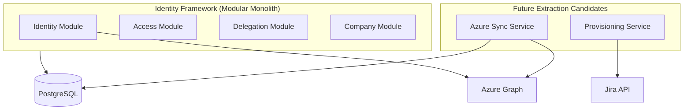

# Improvement Opportunities & Modernization Roadmap

## Re-Architecture Assessment

### Strengths

1. **Clear layered structure** — Controller → Service → Repository separation is consistently applied
2. **Domain model richness** — Entities cover the full IAM domain (users, roles, blueprints, delegation, companies)
3. **Azure integration foundation** — Microsoft Graph SDK properly configured with client credentials
4. **Delegation workflow** — Complete request/approve/revoke cycle for department access
5. **Blueprint concept** — Good abstraction for job-title-to-application access templates
6. **Modern stack** — Java 21, Spring Boot 3.5, PostgreSQL, stateless JWT API
7. **Actuator health checks** — Ready for container orchestration probes
8. **CORS properly configured** — Frontend origins explicitly whitelisted

### Weaknesses

1. **God service anti-pattern** — `UserServiceImpl` handles too many concerns (~605 lines)
2. **Inconsistent API contracts** — Mixed response formats, no versioning, no OpenAPI
3. **Incomplete features** — Company approval workflow scaffolded but bypassed; Jira config unused
4. **No migration strategy** — Hibernate `ddl-auto: update` in production
5. **Manual mappers** — Error-prone, duplicated mapping logic across services
6. **Mixed service patterns** — Some interfaces, some concrete classes
7. **No domain events** — Synchronous-only processing; no audit trail
8. **Configuration management** — All secrets in committed YAML

### Scalability Concerns

| Concern | Impact | Trigger Point |
|---------|--------|---------------|
| Full-table Azure sync every 10 min | DB + Graph API load | >1,000 users |
| `findAll()` in search/subordinate logic | Memory + query time | >5,000 users |
| Single Graph API page (no pagination) | Incomplete sync | >100 Azure users/groups |
| Class-level `@Transactional` with Azure I/O | Connection pool exhaustion | Concurrent user creation |
| No caching | Repeated DB hits for catalogs | High read traffic |
| Monolith deployment | Cannot scale sync independently | Background job contention |
| HikariCP max 10 connections | Bottleneck under load | >10 concurrent write operations |

### Maintainability Concerns

| Concern | Impact |
|---------|--------|
| Zero test coverage | Regressions undetected during changes |
| Magic strings for roles/apps | Fragile role checks break silently |
| Dead code (approval, Jira, TestRunner) | Confuses developers about system capabilities |
| No README or onboarding docs | Slow developer ramp-up |
| Inconsistent exception handling | Unpredictable API error responses |
| `@Data` on JPA entities | Subtle Hibernate bugs |
| No CI/CD pipeline | Manual, error-prone deployments |

### Security Concerns

| Concern | Severity | Immediate Action Required |
|---------|----------|--------------------------|
| Secrets in version control | Critical | Rotate all credentials; move to env vars |
| Plaintext password login | Critical | Enforce BCrypt everywhere |
| Unauthenticated `/api/azure/**` | Critical | Add authentication + admin role |
| JWT HMAC vs Azure RS256 mismatch | High | Align token validation strategy |
| No RBAC on endpoints | High | Add method-level authorization |
| SSN plaintext storage | High | Encrypt at rest |
| DEBUG security logging | Medium | Disable in production |
| Health endpoint detail exposure | Low | Restrict to authorized probes |

### Performance Bottlenecks

1. **`searchUsersByUsername`** — loads entire user table to build subordinate map
2. **`syncUsersFromAzure`** — O(n²) pattern with individual saves in loop
3. **Azure API calls inside DB transactions** — connection pool starvation
4. **No second-level cache** for reference data (departments, job titles, roles)
5. **Missing database indexes** — only unique constraints defined in JPA (no explicit `@Index`)

---

## Design Patterns Currently Used

| Pattern | Implementation | Quality |
|---------|---------------|---------|
| Repository | Spring Data JPA repositories | Good |
| DTO | Request/response objects | Good (inconsistent usage) |
| Mapper | Manual static/component mappers | Adequate |
| Service Layer | Business logic encapsulation | Poor (god service) |
| Composite Key | `UserRoleId` embeddable | Good |
| Strategy | None | Missing (auth could use strategy) |
| Factory | None | Missing (user creation complex enough) |
| Builder | Lombok `@Builder` on some DTOs | Partial |
| Template Method | None | — |
| Observer/Event | None | Missing |
| Specification | None | Missing (search could benefit) |
| Facade | None | Missing (UserService tries to be one) |
| Adapter | AzureADService wraps Graph SDK | Good |

---

## Phased Modernization Roadmap

### Phase 0: Critical Security Fixes (Week 1–2)

**Goal:** Eliminate immediate security vulnerabilities without architectural changes.

| Task | Priority | Effort |
|------|----------|--------|
| Rotate all exposed credentials (DB, Azure, JWT, Jira) | P0 | 1 day |
| Move secrets to environment variables / secret manager | P0 | 1 day |
| Authenticate `/api/azure/**` endpoints (admin role) | P0 | 0.5 day |
| Fix password login to use BCrypt consistently | P0 | 1 day |
| Encode all existing plaintext passwords (migration script) | P0 | 1 day |
| Disable DEBUG security logging in production profile | P1 | 0.5 day |
| Restrict actuator health details | P1 | 0.5 day |
| Add `@EnableScheduling` or remove dead scheduler | P1 | 0.5 day |
| Remove `TestRunner` from production classpath | P1 | 0.5 day |

**Exit criteria:** No secrets in repo; all passwords BCrypt; Azure API protected; penetration test baseline passed.

---

### Phase 1: Stabilize Foundation (Week 3–6)

**Goal:** Establish testing, migrations, and consistent patterns.

| Task | Priority | Effort |
|------|----------|--------|
| Add Flyway/Liquibase for schema migrations | P0 | 3 days |
| Create `application-prod.yaml` profile (externalize all secrets) | P0 | 1 day |
| Standardize all API responses to `ApiResponse<T>` | P1 | 2 days |
| Add Bean Validation (`@Valid`) on all request DTOs | P1 | 2 days |
| Fix `GlobalExceptionHandler` — stop catching all RuntimeException as 400 | P1 | 1 day |
| Add SpringDoc OpenAPI for API documentation | P1 | 1 day |
| Write unit tests for AuthService, DelegateService, BluePrintService | P0 | 5 days |
| Write integration tests for UserController, SecurityConfig | P0 | 3 days |
| Set up CI pipeline (build + test on PR) | P1 | 2 days |
| Create README with setup instructions | P2 | 1 day |
| Remove duplicate pom.xml dependency | P2 | 0.5 day |

**Exit criteria:** >60% test coverage on services; CI green; Flyway managing schema; OpenAPI docs published.

---

### Phase 2: Decompose God Service (Week 7–10)

**Goal:** Split `UserServiceImpl` into focused, testable services.

| Task | Priority | Effort |
|------|----------|--------|
| Extract `AzureSyncService` from UserServiceImpl | P0 | 3 days |
| Extract `UserProvisioningService` (create/delete with Azure) | P0 | 3 days |
| Extract `UserPasswordService` (reset/change password) | P1 | 1 day |
| Extract `UserQueryService` (read/search operations) | P1 | 2 days |
| Introduce `RoleConstants` / enum for magic role strings | P1 | 1 day |
| Add `@PreAuthorize` on sensitive endpoints | P0 | 2 days |
| Align JWT validation with Azure AD (RS256 + issuer-uri) | P0 | 3 days |
| Fix Azure Graph pagination (delta queries) | P1 | 3 days |
| Move Azure API calls outside `@Transactional` boundaries | P0 | 2 days |

**Proposed service split:**

```
UserService (facade — thin orchestrator)
├── UserCrudService
├── UserQueryService
├── UserPasswordService
├── AzureSyncService
└── UserProvisioningService
```

**Exit criteria:** No service class >300 lines; Azure sync isolated; RBAC on admin endpoints.

---

### Phase 3: Complete Domain Features (Week 11–14)

**Goal:** Finish scaffolded features and close domain gaps.

| Task | Priority | Effort |
|------|----------|--------|
| Implement company approval workflow (or remove dead code) | P1 | 5 days |
| Connect blueprint assignment to user_applications provisioning | P0 | 5 days |
| Add Application write endpoints (create/update/deactivate) | P1 | 3 days |
| Link BlueprintApplicationRole to ApplicationRole FK | P2 | 2 days |
| Implement or remove Jira integration | P2 | 5 days (if implementing) |
| Add department/job title write endpoints (HR sync prep) | P2 | 3 days |
| Encrypt SSN at rest (JPA attribute converter) | P1 | 2 days |
| Add audit logging for user/role/access changes | P1 | 3 days |

**Exit criteria:** Blueprint → user application flow works end-to-end; dead code removed or implemented; SSN encrypted.

---

### Phase 4: Performance & Scalability (Week 15–18)

**Goal:** Prepare for production scale.

| Task | Priority | Effort |
|------|----------|--------|
| Replace `findAll()` subordinate map with targeted query | P0 | 1 day |
| Batch Azure sync with pagination + delta tokens | P0 | 5 days |
| Add `@Transactional(readOnly=true)` on all read service methods | P1 | 1 day |
| Add database indexes (email, azure_id, department_id, manager_id) | P1 | 2 days |
| Introduce Caffeine cache for reference data (roles, departments, job titles) | P2 | 3 days |
| Async Azure sync via `@Async` or Spring Batch | P1 | 3 days |
| Connection pool tuning + monitoring | P2 | 2 days |
| Add structured logging (JSON) with correlation IDs | P2 | 2 days |

**Exit criteria:** Sync handles 10K+ users; search paginated without full table scan; p95 API latency <200ms for reads.

---

### Phase 5: Architecture Evolution (Week 19–26)

**Goal:** Position for long-term growth and potential service extraction.

| Task | Priority | Effort |
|------|----------|--------|
| Introduce MapStruct for all entity-DTO mapping | P2 | 5 days |
| Add domain events (UserCreated, AccessGranted) with `@EventListener` | P2 | 5 days |
| Implement Specification pattern for complex search | P2 | 3 days |
| API versioning (`/api/v1/...`) | P2 | 3 days |
| Extract Azure Sync as independent schedulable module | P3 | 5 days |
| Evaluate HR system connector (Odoo/Workday) adapter pattern | P3 | 10 days |
| Consider read replicas for search-heavy endpoints | P3 | 5 days |
| Docker compose for local dev (app + postgres) | P2 | 2 days |
| Kubernetes deployment manifests / Helm chart | P3 | 5 days |

**Potential future architecture:**



**Exit criteria:** Modular packages with clear boundaries; event-driven hooks for provisioning; deployment documented.

---

## Quick Wins (Can Start Immediately)

1. Remove `TestRunner` and unused DTOs/entities (or implement them)
2. Add `@EnableScheduling` to main application class
3. Create `.env.example` without real secrets
4. Add `@EqualsAndHashCode(onlyExplicitlyIncluded = true)` to all entities (replace `@Data`)
5. Extract role name constants to a shared class
6. Fix `RoleServiceImpl.searchRolesByName` to actually paginate
7. Sanitize email input in Azure OData filter
8. Add `@Index` annotations on frequently queried columns

---

## Decision Points for Stakeholders

| Decision | Options | Recommendation |
|----------|---------|----------------|
| JWT strategy | Custom HMAC vs Azure AD RS256 | Azure AD RS256 (align with Entra) |
| Company approval | Implement workflow vs auto-approve | Implement if business requires; else remove dead code |
| Jira integration | Build vs remove config | Remove config until requirements defined |
| HR sync | Odoo vs Workday vs defer | Defer; design adapter interface in Phase 3 |
| Deployment target | Coolify vs Kubernetes vs Vercel functions | Document current (Coolify + PostgreSQL); plan K8s for Phase 5 |
| Password login | Keep vs Azure-only SSO | Keep but fix BCrypt; deprecate plain-text path |
| Monolith vs microservices | Stay monolith vs extract sync | Modular monolith now; extract sync in Phase 5 if needed |

---

## Success Metrics

| Metric | Current | Phase 1 Target | Phase 4 Target |
|--------|---------|----------------|----------------|
| Test coverage | ~0% | 60% | 80% |
| Max service class size | 605 lines | 400 lines | 250 lines |
| API response consistency | ~70% | 100% | 100% |
| Secrets in repo | Yes | No | No |
| Sync duration (1000 users) | Unknown | <30s | <10s |
| OpenAPI documentation | None | Complete | Complete |
| Critical security findings | 4+ | 0 | 0 |

---

## Conclusion

The identity-framework has a solid domain foundation and modern technology choices, but requires immediate security remediation before any feature work. The recommended approach is **stabilize → decompose → complete → scale → evolve**, avoiding premature microservices extraction while establishing clear module boundaries within the monolith.

Phase 0 (security) should begin immediately. Phases 1–2 can overlap once critical fixes are deployed. Phase 3+ depends on business priorities for approval workflows, Jira, and HR integrations.
