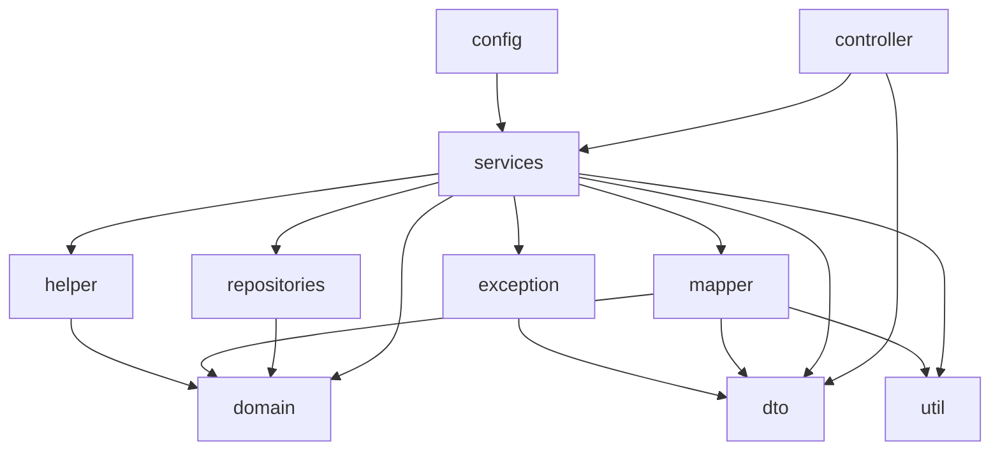

# Package Analysis

## Package Dependency Graph

---

## `com.ndash.identity_framework`

| Aspect | Detail |
|--------|--------|
| **Purpose** | Root package; Spring Boot application entry |
| **Files** | `IdentityFrameworkApplication.java` |
| **Dependencies** | Spring Boot only |
| **Coupling** | None |

---

## `controller`

| Aspect | Detail |
|--------|--------|
| **Purpose** | REST API presentation layer |
| **Responsibilities** | HTTP routing, JWT principal extraction, response wrapping |
| **Dependencies** | `services`, `dto`, Spring Security JWT |
| **Coupling** | Depends on services; no direct repository access |

**Controllers (11):**

| Class | Base Path | Service(s) |
|-------|-----------|------------|
| `LoginController` | `/api/login` | `AuthService` |
| `UserController` | `/api/users` | `UserService` |
| `RoleController` | `/api/roles` | `RoleService` |
| `ApplicationController` | `/api/applications` | `ApplicationService` |
| `BlueprintController` | `/api/blueprints` | `BluePrintService` |
| `CompanyController` | `/api/companies` | `CompanyService` |
| `DepartmentController` | `/api/departments` | `DepartmentService` |
| `JobTitleController` | `/api/job-titles` | `JobTitleService` |
| `DelegateController` | `/api/delegates` | `DelegateService` |
| `SettingController` | `/api/settings` | `SettingService` |
| `AzureController` | `/api/azure` | `AzureADService` |

**Coupling notes:**
- Response format inconsistent (`ApiResponse` vs raw types)
- Some controllers inject concrete services, others use interfaces
- No dedicated validation layer (`@Valid` largely unused)

---

## `services` / `services.impl`

| Aspect | Detail |
|--------|--------|
| **Purpose** | Business logic and orchestration |
| **Responsibilities** | CRUD, Azure sync, delegation workflow, auth |
| **Dependencies** | `repositories`, `domain`, `dto`, `mapper`, `helper`, `exception`, external Azure SDK |
| **Coupling** | `CompanyService` → `UserService` (service-to-service); `UserServiceImpl` is heavily coupled to Azure |

**Interface + Impl pattern (partial):**

| Interface | Implementation |
|-----------|----------------|
| `AuthService` | `AuthServiceImpl` |
| `UserService` | `UserServiceImpl` |
| `RoleService` | `RoleServiceImpl` |
| `DepartmentService` | `DepartmentServiceImpl` |
| `JobTitleService` | `JobTitleServiceImpl` |
| `DelegateService` | `DelegateServiceImpl` |
| `BluePrintService` | `BluePrintServiceImpl` |

**Concrete `@Service` (no interface):**
- `AzureADService`, `ApplicationService`, `CompanyService`, `SettingService`

**Dev artifact:**
- `TestRunner` — `@Configuration` with empty `CommandLineRunner` (should not ship to production)

---

## `repositories`

| Aspect | Detail |
|--------|--------|
| **Purpose** | Data access via Spring Data JPA |
| **Responsibilities** | CRUD + derived/custom queries |
| **Dependencies** | `domain` entities only |
| **Coupling** | Low; standard Spring Data pattern |

**13 repositories** — see `database-model.md` for query details.

**Missing repositories for entities:**
- `CompanyApprovalRequest`
- `UserRole` (managed via cascade)
- `BlueprintApplicationRole` (managed via cascade)

---

## `domain`

| Aspect | Detail |
|--------|--------|
| **Purpose** | JPA entity model |
| **Responsibilities** | Persistence mapping, relationships, lifecycle callbacks |
| **Dependencies** | Jakarta Persistence, Lombok |
| **Coupling** | No upward dependencies (clean) |

**Sub-packages:**
- `domain.enums` — `UserSource`, `RequestStatus`, `ExternalSource`

---

## `dto`

| Aspect | Detail |
|--------|--------|
| **Purpose** | API contracts (request/response objects) |
| **Responsibilities** | Data transfer; no business logic |
| **Dependencies** | Lombok, minimal domain enums |
| **Coupling** | Used by controller, services, exception handler |

**28 DTOs** including several for unimplemented features (`ApproveApprovalRequestDto`, `RejectApprovalRequestDto`, `CompanyApprovalResponseDto`, `LoginResponse`).

---

## `mapper`

| Aspect | Detail |
|--------|--------|
| **Purpose** | Entity ↔ DTO conversion |
| **Responsibilities** | Field mapping, SSN masking, business display rules |
| **Dependencies** | `domain`, `dto`, `util` |
| **Coupling** | Low |

| Class | Style | Notes |
|-------|-------|-------|
| `UserMapper` | Static methods | Hardcoded "essential" app names (Slack, Jira) |
| `RoleMapper` | Static methods | |
| `ApplicationMapper` | Static methods | |
| `BlueprintMapper` | `@Component` instance | |
| `JobTitleMapper` | `@Component` instance | |

**No MapStruct** — all mapping is manual.

---

## `config`

| Aspect | Detail |
|--------|--------|
| **Purpose** | Spring configuration beans |
| **Responsibilities** | Security, CORS, scheduling, startup |
| **Dependencies** | `services` |
| **Coupling** | Medium — security config defines all protected routes manually |

| Class | Type | Role |
|-------|------|------|
| `SecurityConfig` | `@Configuration` | JWT resource server, CORS, route authorization |
| `AzureDataInitializer` | `@Component` | Startup hook (sync disabled) |
| `AzureUserSyncScheduler` | `@Component` | 10-minute Azure sync |

---

## `exception`

| Aspect | Detail |
|--------|--------|
| **Purpose** | Error handling |
| **Responsibilities** | Custom exceptions + global HTTP error mapping |
| **Dependencies** | `dto.ApiResponse` |
| **Coupling** | Low |

| Class | HTTP Status |
|-------|-------------|
| `BadRequestException` | 400 |
| `ResourceNotFoundException` | 404 |
| `ApiException` (checked) | 500 |
| `RuntimeException` (catch-all) | 400 |

**Issue:** Catch-all `RuntimeException` handler returns 400 for all runtime errors, masking server errors.

---

## `helper`

| Aspect | Detail |
|--------|--------|
| **Purpose** | Reusable non-service logic |
| **Files** | `AzureUserUpdater` |
| **Dependencies** | `domain`, Microsoft Graph models |
| **Coupling** | Called only from `UserServiceImpl` |

---

## `util`

| Aspect | Detail |
|--------|--------|
| **Purpose** | Shared utilities |
| **Files** | `CommonUtil` (SSN masking, avatar icon generation) |
| **Dependencies** | None |
| **Coupling** | Used by `UserMapper` |

---

## Cross-Package Coupling Assessment

| From | To | Severity | Reason |
|------|----|----------|--------|
| `CompanyService` | `UserService` | Medium | Circular risk if UserService ever calls CompanyService |
| `UserServiceImpl` | `AzureADService` | High | Tight Azure coupling throughout user lifecycle |
| `UserMapper` | Hardcoded app names | Low | Display logic in mapper |
| `services` | `services.TestRunner` | Low | Dev code in production package |
| Controllers | Mixed response types | Medium | Inconsistent API contract |

**No cyclic dependencies detected** at compile time, but `UserServiceImpl` approaches god-service status (~600 lines, multiple domains).

---

## Spring Component Inventory

| Category | Count | Location |
|----------|-------|----------|
| `@RestController` | 11 | `controller` |
| `@Service` | 11 + 7 impl | `services` |
| `@Repository` | 13 | `repositories` |
| `@Configuration` | 1 (+ TestRunner) | `config`, `services` |
| `@Component` | 4 | `config`, `helper`, `mapper` |
| `@ControllerAdvice` | 1 | `exception` |
| `@Scheduled` | 1 | `config` |
| Custom Filters | 0 | — |
| Interceptors | 0 | — |
| Event Listeners | 0 | — |
| Cache config | 0 | — |
| Async processing | 0 | — |
