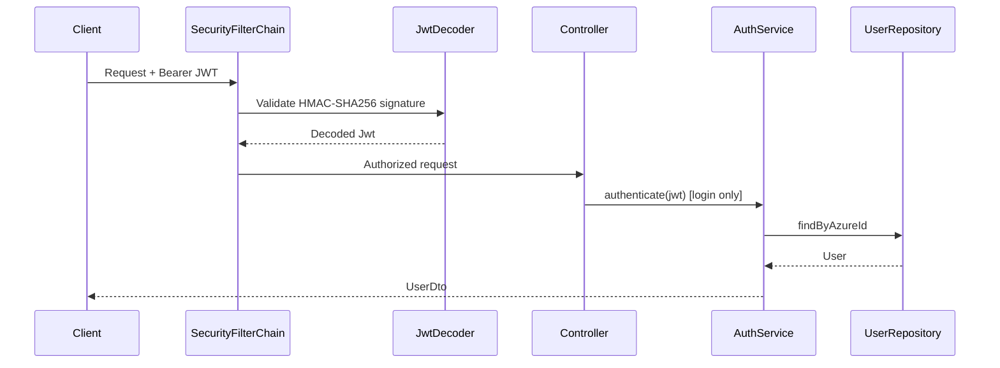

# Security Analysis

## Security Architecture



---

## Authentication

### Mechanisms

| Mechanism | Endpoint | Implementation |
|-----------|----------|----------------|
| JWT Bearer Token | Protected `/api/**` routes | Spring OAuth2 Resource Server |
| Username/Password | `POST /api/login` | Custom `AuthServiceImpl` (local DB lookup) |
| Azure OAuth ROPC | — | **Commented out** in AuthServiceImpl |

### JWT Configuration

**Decoder:** Custom `NimbusJwtDecoder` with HMAC-SHA256 symmetric key from `${jwt.secret}`.

**Also configured (unused for validation):**
```yaml
spring.security.oauth2.resourceserver.jwt.issuer-uri: https://login.microsoftonline.com/{tenant}/v2.0
```

**Conflict:** Application configures both:
1. HMAC symmetric key decoder (active `@Bean`)
2. Azure AD issuer URI in properties (not used by custom decoder)

Azure Entra ID tokens are RS256-signed by Microsoft — they will **not validate** against the HMAC decoder unless the frontend sends custom HMAC tokens.

### JWT Claims Used

| Claim | Usage |
|-------|-------|
| `oid` | Azure object ID — lookup in AuthService |
| `upn` | Email/username |
| `name` | Display name |
| `userId` | Custom claim — used in controllers for audit/ownership |
| `sub` | Subject — used in password reset for logged-in user lookup |

---

## Authorization

### Route-Level (SecurityConfig)

**Authenticated routes:**
```
/api/applications/**
/api/roles/**
/api/users/**
/api/blueprints/**
/api/job-titles/**
/api/departments/**
/api/delegates/**
/api/settings/**
/api/companies/**
```

**Public routes (permitAll):**
- `OPTIONS /**`
- `/actuator/**`
- `/swagger/**`, `/api-docs/**`
- `/api/login`
- `/api/azure/**` ← **Unauthenticated Azure Graph proxy**
- All other unmatched routes

### Method-Level Authorization

**None.** No `@PreAuthorize`, `@Secured`, or role-based access control on endpoints.

Business-level authorization exists only in:
- `UserServiceImpl.resetPassword` — checks for `"administration"` or `"super_admin"` role
- `DelegateServiceImpl.revokeDelegate` — checks requester or approver identity

### Role Model

| Role Name | Purpose | Enforcement |
|-----------|---------|-------------|
| `user` | Default role | Assigned on create, no endpoint restriction |
| `manager` | Manager listing | Used in `findAllManagers()` query only |
| `administration` | Admin password reset | Service-level check only |
| `super_admin` | Super admin | Service-level check only |
| Azure groups | Auto-synced as roles | Created during sync, no mapping logic |

**No permission model** — roles are strings with minimal enforcement.

---

## Password Security

| Aspect | Status | Risk |
|--------|--------|------|
| Storage — new users | BCrypt encoded | OK |
| Storage — synced users | Plain text (`"Test123"`) | **Critical** |
| Login comparison | Plain text `.equals()` | **Critical** |
| PasswordEncoder in AuthService | Injected but unused | Bug |
| Default passwords | Hardcoded `Test@123`, `StrongPassword123!` | **High** |
| Force password change (Azure) | Enabled on Azure create | OK for Azure path |

---

## CORS Configuration

```java
Allowed Origins:
  - https://identityframework.vercel.app
  - https://idf.ndashdigital.com/
  - http://localhost:3000/

Allowed Methods: GET, POST, PUT, DELETE, OPTIONS
Allowed Headers: Authorization, Content-Type, Accept, Origin
```

**Issues:**
- Trailing slashes on some origins may cause CORS mismatches
- No credential configuration explicitly set

---

## CSRF

Disabled (`AbstractHttpConfigurer::disable`) — appropriate for stateless JWT API.

---

## Session Management

Stateless (`SessionCreationPolicy.STATELESS`) — no server-side sessions.

---

## Sensitive Data Handling

| Data | Storage | API Exposure |
|------|---------|--------------|
| SSN | Plaintext in DB | Masked via `CommonUtil.maskSSN()` |
| Passwords | Mixed BCrypt/plaintext | Never returned in DTOs |
| Azure secrets | `application.yaml` (committed) | N/A |
| DB credentials | `application.yaml` (committed) | N/A |
| Jira API token | `application.yaml` (committed, unused) | N/A |

---

## Security Filters & Interceptors

| Component | Present |
|-----------|---------|
| Custom Security Filters | No |
| Spring Security Filter Chain | Yes (default + OAuth2 resource server) |
| HTTP Interceptors | No |
| Servlet Filters | No custom |
| AOP Security Aspects | No |

---

## Actuator Exposure

```yaml
management.endpoints.web.exposure.include: health, info
management.endpoint.health.show-details: always
```

Health endpoint is **public** with full details exposed — may leak infrastructure information.

---

## Threat Model Summary

| Threat | Severity | Current Mitigation |
|--------|----------|-------------------|
| Unauthenticated Azure API access | **Critical** | None — `/api/azure/**` is public |
| Secrets in source control | **Critical** | None |
| Plaintext password storage/login | **Critical** | None |
| No RBAC on endpoints | **High** | Any authenticated user can access all APIs |
| JWT algorithm mismatch | **High** | Custom HMAC vs Azure RS256 |
| OData injection in Graph filter | **Medium** | Email not sanitized in filter string |
| Hardcoded Azure passwords | **High** | Default password in code |
| SSN plaintext storage | **High** | API masking only |
| Overly broad RuntimeException → 400 | **Low** | Information disclosure in error messages |
| DEBUG security logging in prod | **Medium** | `logging.level.org.springframework.security: DEBUG` |

---

## OAuth2 Dependencies

```xml
spring-boot-starter-security
spring-boot-starter-oauth2-resource-server (×2 duplicate in pom.xml)
spring-boot-starter-oauth2-client
spring-security-oauth2-jose
azure-identity
microsoft-graph
nimbus-jose-jwt
```

OAuth2 client starter is included but no client registration configuration exists — likely unused.

---

## Recommendations (see improvement-opportunities.md)

1. Secure `/api/azure/**` endpoints immediately
2. Move secrets to environment variables / secret manager
3. Fix password hashing consistency
4. Align JWT validation with Azure AD (RS256 + issuer-uri)
5. Add `@PreAuthorize` role checks on sensitive endpoints
6. Remove DEBUG security logging for production
