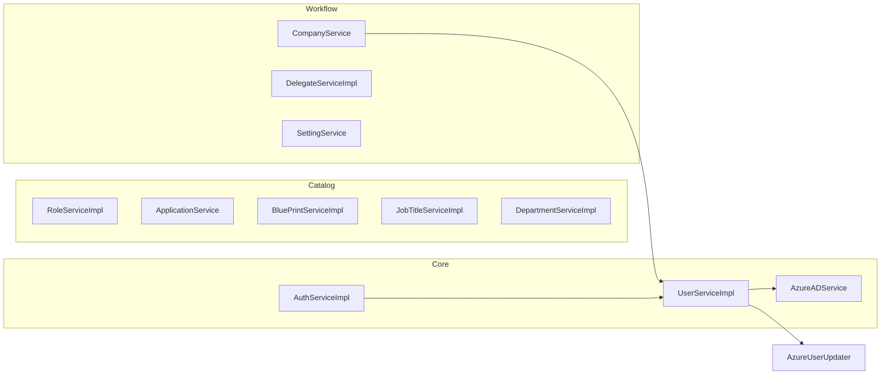

# Service Layer Analysis

## Service Architecture Overview

---

## AuthService / AuthServiceImpl

| Attribute | Detail |
|-----------|--------|
| **Responsibilities** | Authenticate via JWT claims or username/password |
| **Transaction** | None |
| **Repositories** | `UserRepository` |

### Methods

| Method | Input | Output | Downstream |
|--------|-------|--------|------------|
| `authenticate(Jwt)` | Azure JWT | `ApiResponse<UserDto>` | `UserRepository.findByAzureId` |
| `authenticate(LoginRequest)` | username/password | `ApiResponse<UserDto>` | `UserRepository.findByEmail` |

### Business Flow — JWT Auth
1. Extract `oid`, `upn`, `name` from JWT
2. Find local user by `azureId`
3. Reject if not found or inactive
4. Return `UserDto`

### Business Flow — Password Auth
1. Find user by email (used as username)
2. Compare password with **plain-text** stored password
3. Return user DTO or 401

### Issues
- `PasswordEncoder` injected but unused in password login
- Azure ROPC flow commented out
- JWT auth path doesn't use `PasswordEncoder`

---

## AzureADService

| Attribute | Detail |
|-----------|--------|
| **Responsibilities** | Microsoft Graph API operations |
| **Transaction** | None |
| **Repositories** | None |
| **External** | Microsoft Graph via `GraphServiceClient` |

### Methods

| Method | Graph Operation |
|--------|-----------------|
| `getAllUsers()` | `GET /users` (first page only) |
| `createUser(displayName, mail)` | `POST /users` |
| `deleteUser(userId)` | `DELETE /users/{id}` |
| `getAllGroups()` | `GET /groups` (first page only) |
| `getUserByEmail(email)` | `GET /users?$filter=mail eq '...'` |
| `updateUser(azureId, ...)` | `PATCH /users/{id}` |

### Configuration
- Auth: `ClientSecretCredential` (client credentials flow)
- Scope: `https://graph.microsoft.com/.default`

### Issues
- Hardcoded domain `@NETORGFT16179011.onmicrosoft.com`
- Hardcoded default password `StrongPassword123!`
- No pagination for list operations
- SQL injection style risk in OData filter (email not escaped)

---

## UserService / UserServiceImpl

| Attribute | Detail |
|-----------|--------|
| **Responsibilities** | Full user lifecycle — largest service (~600 lines) |
| **Transaction** | Class-level `@Transactional` |
| **Repositories** | `UserRepository`, `RoleRepository`, `UserApplicationRepository`, `BlueprintRepository`, `CompanyRepository` |
| **External** | `AzureADService`, `AzureUserUpdater` |
| **Other** | `PasswordEncoder`, `UserMapper` |

### Methods

| Method | Repositories | External | Notes |
|--------|-------------|----------|-------|
| `createUser` | User, Role, Blueprint, Company | Azure create/lookup | Provisions Azure + local |
| `getAllUsers` | User | — | Includes subordinates |
| `getUserById` | User, UserApplication | — | Includes apps + subordinates |
| `syncUsersFromAzure` | User, Role | Azure users/groups | Deactivates missing users |
| `deleteUser` | User | Azure delete | Azure first, then local |
| `searchUsersByUsername` | User (×2) | — | Loads ALL users for subordinate map |
| `updateUser` | User, Role, Blueprint | Azure update (commented) | Role diff/add/remove |
| `resetPassword` | User | — | Admin vs self-service |
| `getUsersByDepartment` | User | — | Active users only |
| `getAllManagers` | User | — | Role name "manager" |

### Private Methods
- `getFirstName` / `getLastName` — parse display name
- `syncRolesFromAzure` — create local roles from Azure groups
- `getSubordinates` — manager hierarchy lookup

### Transaction Boundaries
- Entire class wrapped in `@Transactional` — all methods run in write transaction including read-only getters
- Azure API calls inside transaction (long-running external calls hold DB connection)

---

## RoleService / RoleServiceImpl

| Attribute | Detail |
|-----------|--------|
| **Responsibilities** | Platform role CRUD |
| **Transaction** | None |
| **Repositories** | `RoleRepository` |

### Methods

| Method | Notes |
|--------|-------|
| `createRole` | Direct save, no duplicate check |
| `getAllRoles` | |
| `searchRolesByName` | **Ignores pagination params** — uses non-paginated query |
| `getRoleById` | |
| `deleteRole` | Hard delete, no cascade check |

---

## ApplicationService

| Attribute | Detail |
|-----------|--------|
| **Responsibilities** | Read-only application catalog |
| **Transaction** | None |
| **Repositories** | `ApplicationRepository`, `UserApplicationRepository` |

### Methods

| Method | Notes |
|--------|-------|
| `searchApplicationsByName` | Paginated |
| `getAllApplications` | Paginated |
| `getApplicationById` | |
| `getUserApplications` | Active assignments only |

**No write operations** — application provisioning not exposed via API.

---

## BluePrintService / BluePrintServiceImpl

| Attribute | Detail |
|-----------|--------|
| **Responsibilities** | Blueprint template CRUD |
| **Transaction** | Class-level; read methods `@Transactional(readOnly=true)` |
| **Repositories** | `BlueprintRepository`, `JobTitleRepository`, `ApplicationRepository`, `ApplicationRoleRepository` (unused) |

### Methods

| Method | Flow |
|--------|------|
| `getAllBlueprints` | findAll → map |
| `getBlueprintById` | findById or 404 |
| `createBlueprint` | Validate → resolve job titles → build role mappings → save |
| `updateBlueprint` | Clear and rebuild job titles + role mappings |
| `deleteBlueprint` | Hard delete |

### Validation (`validateRequest`)
- Name required
- At least one job title ID
- At least one application with roles

---

## CompanyService

| Attribute | Detail |
|-----------|--------|
| **Responsibilities** | Company CRUD with user provisioning |
| **Transaction** | None (relies on UserService transaction) |
| **Repositories** | `CompanyRepository`, `UserRepository` |
| **Service deps** | `UserService` |

### Methods

| Method | Flow |
|--------|------|
| `createCompany` | Build company → create primary contact via UserService → set approver → save (status=APPROVED) |
| `getAllCompanies` | Filter APPROVED only |
| `updateCompany` | Update company + inline contact user fields |
| `deleteCompany` | Hard delete |
| `getMyCompanies` | By approver ID |

---

## DelegateService / DelegateServiceImpl

| Attribute | Detail |
|-----------|--------|
| **Responsibilities** | Department delegation workflow |
| **Transaction** | `@Transactional` on `revokeDelegate` only |
| **Repositories** | `DelegateRequestRepository`, `UserDepartmentAccessRepository`, `UserRepository`, `DepartmentRepository` |

### Methods

| Method | Flow |
|--------|------|
| `createRequest` | Check no pending duplicate → save PENDING request |
| `getPendingRequests` | By department + PENDING status |
| `actOnRequest` | Update status → if APPROVED, grant access |
| `getDelegatedUsers` | Get user's dept access → list users in those departments |
| `getMyRequests` | By requester, exclude REVOKED |
| `revokeDelegate` | Verify permission → REVOKED → delete access |

---

## DepartmentService / DepartmentServiceImpl

| Attribute | Detail |
|-----------|--------|
| **Responsibilities** | Read-only department listing |
| **Repositories** | `DepartmentRepository` |

Single method: `getAllDepartments()` → map to DTO.

---

## JobTitleService / JobTitleServiceImpl

| Attribute | Detail |
|-----------|--------|
| **Responsibilities** | Read-only job title catalog |
| **Transaction** | Class-level + readOnly on getters |
| **Repositories** | `JobTitleRepository` |

Filters out `"UNKNOWN"` job titles from results.

---

## SettingService

| Attribute | Detail |
|-----------|--------|
| **Responsibilities** | Key-value settings CRUD |
| **Repositories** | `SettingRepository` |

| Method | Notes |
|--------|-------|
| `getAllSettings` | Parses BOOLEAN type to Java Boolean |
| `saveAll` | Upsert by key |
| `getBoolean` | Single key lookup with default |

---

## Scheduled / Startup Services

| Component | Trigger | Action |
|-----------|---------|--------|
| `AzureUserSyncScheduler` | `@Scheduled(fixedRate=600000)` | `syncUsersFromAzure()` |
| `AzureDataInitializer` | `CommandLineRunner` on startup | Sync **disabled** (commented out) |
| `TestRunner` | `CommandLineRunner` | Empty — dev stub |

**Note:** `@EnableScheduling` not present on application class — scheduler may not execute.

---

## Service-to-Repository Matrix

| Repository | Services |
|------------|----------|
| UserRepository | Auth, User, Company, Delegate |
| RoleRepository | User, Role, TestRunner |
| UserApplicationRepository | User, Application, TestRunner |
| BlueprintRepository | User, BluePrint |
| CompanyRepository | User, Company |
| ApplicationRepository | Application, BluePrint, TestRunner |
| ApplicationRoleRepository | BluePrint (injected, unused) |
| SettingRepository | Setting |
| DepartmentRepository | Department, Delegate |
| JobTitleRepository | JobTitle, BluePrint |
| DelegateRequestRepository | Delegate |
| UserDepartmentAccessRepository | Delegate |
| CompanyContactRepository | **None** |
| CompanyRepository | Company, User |

---

## External Integration Points in Services

| Service | Integration | When |
|---------|-------------|------|
| UserServiceImpl | Microsoft Graph | create, delete, sync users/groups |
| AzureADService | Microsoft Graph | All Azure operations |
| AuthServiceImpl | Azure OAuth (disabled) | Commented ROPC flow |
| CompanyService | Indirect via UserService | Primary contact creation |

**Jira:** Config properties exist (`jira.api-token`, `jira.base-url`) but **no service uses them**.

---

## Transaction Boundary Issues

1. **UserServiceImpl** — class-level `@Transactional` wraps read methods and Azure API calls
2. **CompanyService.createCompany** — spans UserService transaction + company save without explicit boundary
3. **DelegateServiceImpl** — only revoke is transactional; approve/reject could leave inconsistent state on failure
4. **No `@Transactional(readOnly=true)`** on UserService read methods despite class-level write transaction
